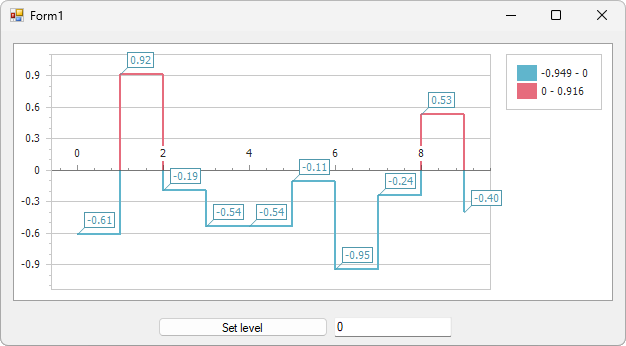

<!-- default badges list -->

<!-- default badges end -->
<!-- default file list -->
*Files to look at*:

* **[Form1.cs](./CS/Form1.cs) (VB: [Form1.vb](./VB/Form1.vb))**
<!-- default file list end -->
# Chart for WinForms - Change the Series Line Color When the Value is Under a Predefined Level

This example creates a step line chart with the capability to change the series line color when the value is under a predefined level.

You can use the [RangeSegmentColorizer](https://docs.devexpress.com/CoreLibraries/DevExpress.XtraCharts.RangeSegmentColorizer) to color the line series view and its descendants. To do this, assign the `RangeSegmentColorizer` object to the [LineSeriesView.SegmentColorizer](https://docs.devexpress.com/CoreLibraries/DevExpress.XtraCharts.LineSeriesView.SegmentColorizer) property.

## Documentation

* [Segment Colorizers](https://docs.devexpress.com/WindowsForms/400714/controls-and-libraries/chart-control/appearance-customization/segment-colorizers)
* [Step Line Chart](https://docs.devexpress.com/WindowsForms/2977/controls-and-libraries/chart-control/series-views/2d-series-views/point-and-line-series-views/step-line-chart)
* [LineSeriesView.SegmentColorizer](https://docs.devexpress.com/CoreLibraries/DevExpress.XtraCharts.LineSeriesView.SegmentColorizer)
* [RangeSegmentColorizer](https://docs.devexpress.com/CoreLibraries/DevExpress.XtraCharts.RangeSegmentColorizer)

<!-- feedback -->
## Does this example address your development requirements/objectives?

 

(you will be redirected to DevExpress.com to submit your response)
<!-- feedback end -->
